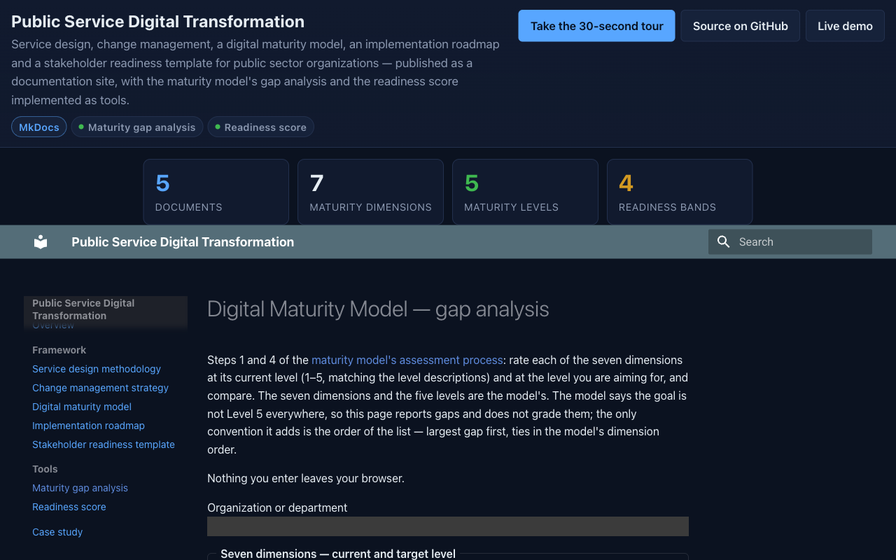

# Public-Service-Digital-Transformation: a digital-transformation framework for public sector organizations, published as a site, with its maturity model and stakeholder readiness template turned into tools

[](https://github.com/Freddricklogan/Public-Service-Digital-Transformation/actions/workflows/deploy.yml)
[](#5-getting-started--verification)
[](https://github.com/Freddricklogan/Public-Service-Digital-Transformation/actions/workflows/codeql.yml)
[](LICENSE)
[](https://freddricklogan.github.io/Public-Service-Digital-Transformation/)

## 1. Executive Summary & Business Impact

**Problem statement.** A public sector organization starting a
digital transformation needs a service-design method, a change
strategy, a way to know where it stands, a phased roadmap and a way to
read its stakeholders. This repository held all five as Markdown,
readable on GitHub and nowhere else. Its two instruments — a maturity
model rated 1–5 on seven dimensions, and a stakeholder readiness score
weighted across five — were tables of blanks that each department
filled in by hand and someone else added up.

**What this delivers.** The framework as a navigable site, and the
two instruments as tools. The maturity gap analysis takes a current
and a target level for each of the seven dimensions and returns the
means, the lowest dimension and the gaps ranked largest first. The
readiness score applies the template's weights (15/30/20/20/15) and
its four bands. Both export Markdown for the assessment record.
Nothing leaves the browser.

**Who it is for.** Government CIOs and programme managers running a
transformation, digital service teams, and the analysts who have to
turn a self-assessment into a roadmap.

**[→ Read the full case study](docs/CASE_STUDY.md)**

## 2. Demonstrated Competencies & Technical Skills

| Area | What the repository shows |
| --- | --- |
| Public sector transformation | Service design, change management, a five-level maturity model, a four-phase roadmap, a stakeholder template — written for the constraints of government |
| Instrument engineering | Two documents' scoring rules made executable, with the one place the document was silent (gap ordering) stated as a convention on the page |
| Numerical care | Weighted sums rounded before classification so five 4s are a Champion, not 3.9999999999999996 |
| Static publishing | MkDocs + Material, `strict` build so a broken cross-reference fails CI |
| Front-end discipline | ES modules, no inline handlers, no `innerHTML`; pure logic separated from DOM code and tested at 100% statements |
| CI/CD | Lint → tests → strict site build → npm audit + Trivy → Pages deploy; CodeQL on a schedule |

## 3. System Architecture & Data Flow

```
docs/*.md ───────────────────┐
docs/tools/{maturity,readiness}.md ┤  mkdocs build --strict  ──►  site/  ──►  GitHub Pages
docs/assets/                 │
  ├─ lib/maturity.js  ◄──────┼── tests/maturity.test.js   (Vitest, 100% statements)
  ├─ lib/readiness.js ◄──────┼── tests/readiness.test.js
  ├─ maturity-page.js        │   form → analyse() → means, weakest, ranked gaps, Markdown
  ├─ readiness-page.js       │   form → score()   → weighted overall, band, Markdown
  ├─ site.js                 │   mounts the Executive Shell on every page
  └─ shell/                  │   exec-shell.js / .css (vendored)
```

No CSP `<meta>` is set because Material relies on inline scripts; the
tools' own code has no inline handlers or styles.

## 4. Technical Highlights & Engineering Decisions

- **Report, don't grade.** The maturity model says the goal is not
  Level 5 everywhere, so the gap analysis returns gaps and a ranking
  and never a verdict. The only convention added — largest gap first,
  ties in the model's dimension order — is written on the page.
- **A target below current is a question, not an error.** It is
  accepted, shown separately as "check the rating", and excluded from
  the ranked gaps.
- **The readiness overall is only defined when complete.** The
  template's weighted sum has no meaning over four of five
  dimensions, so the tool says which are missing instead of
  extrapolating.
- **Round, then classify.** The band boundaries are one-decimal
  values in the template; the score is rounded to two decimals before
  comparison so floating-point residue cannot move a stakeholder
  across a boundary.
- **Licence preserved.** The original README released the framework
  under CC BY 4.0; the LICENSE file records that and applies MIT to
  the code only.

## 5. Getting Started & Verification

**Prerequisites.** Node 22, Python 3.12 and `uv`.

```bash
git clone https://github.com/Freddricklogan/Public-Service-Digital-Transformation.git
cd Public-Service-Digital-Transformation
npm ci && uv venv && uv pip install -r requirements.txt
npm run check            # eslint, vitest --coverage, mkdocs build --strict
uv run mkdocs serve      # http://127.0.0.1:8000/Public-Service-Digital-Transformation/
```

**Verification — the numbers this repository actually produced:**

| Check | Result |
| --- | --- |
| Tests (Vitest) | **12 passed / 12** (6 maturity, 6 readiness) |
| Coverage | **100%** statements, 98.95% branches over `docs/assets/lib/` |
| ESLint | clean |
| `mkdocs build --strict` | 0 warnings, 9 pages |
| Instruments | 7 dimensions × 5 levels; 5 readiness dimensions, weights 15/30/20/20/15, 4 bands |
| Site smoke (headless Chrome) | **0 console errors / 0 warnings**; maturity: 14 selects, a 7/7 profile gives means 2.71 → 3.86, lowest Security and Privacy (Level 1), six ranked gaps, one target-below-current warning; readiness: 5 selects, five 4s → "4.00 — Champion", desire 1 → "3.10 — Supporter"; tour step 1 of 2 opens; no horizontal scroll at 1280 or 400 px |

## 6. Live Demo & Production Showcase

**<https://freddricklogan.github.io/Public-Service-Digital-Transformation/>** —
the framework, with **Tools → Maturity gap analysis** and **Tools →
Readiness score**.

**30-second guided walkthrough.** Press **Take the 30-second tour** in
the header: the five documents, then the maturity tool where rating
seven dimensions produces a ranked gap list for the roadmap.



**Related.** EdTech-Policy-Framework (technology-evaluation rubric
scorer) and AI-Ethics-Education-Framework (impact-assessment risk
worksheet) use the same site kit.

---

## License

Framework documents CC BY 4.0 (as the original README stated); code
MIT — see [LICENSE](LICENSE).
